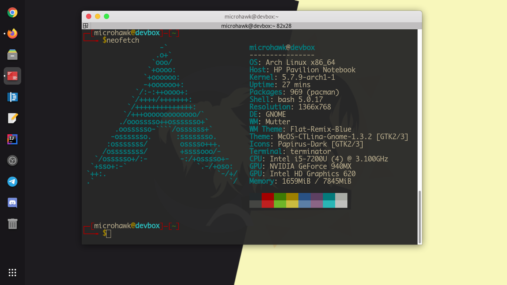

# mybashrc
##### Just added and config bashrc of Parrot OS.
## Tested on Arch Linux and Ubuntu.

# Installation
     git clone https://github.com/micro-hawk/mybashrc.git
     mv ~/.bashrc .bashrc.bak
     mv mybashrc/.bashrc ~/.bashrc

##### That's it You're done with that :)

# Thanks
   ###### $->MICROHAWK
        

